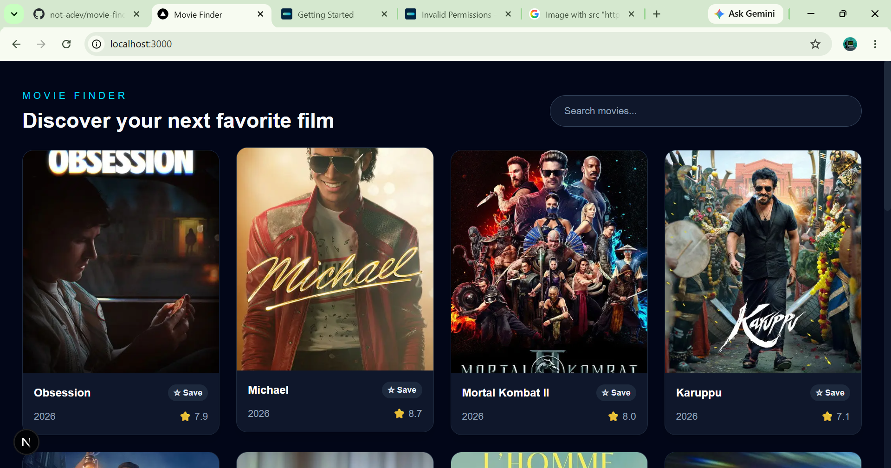
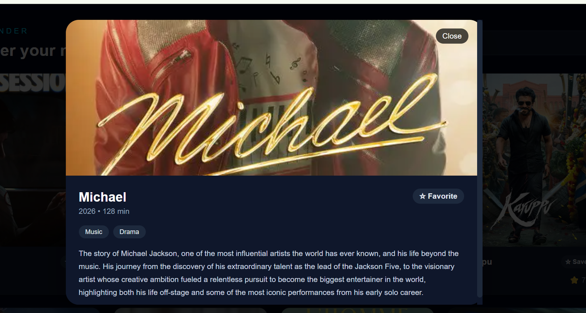

# Movie Finder

A modern movie discovery web app built with Next.js that helps users search movies, browse them page by page, open detailed information, and save favorites using browser storage.

## Features

- Browse popular movies with manual pagination
- Search movies by title in real time
- View movie details in a modal overlay
- Save or remove favorites with local storage persistence
- Responsive layout for desktop and mobile screens
- Loading, error, and no-results states

## Tech Stack

- Next.js
- React
- TypeScript
- Tailwind CSS
- TMDB API

## Screenshots

### Home page



### Movie details modal



### Favorites state


## API Used

This project uses the TMDB API for movie data.

## Environment Variables

Create a `.env.local` file in the project root and add:

```bash
NEXT_PUBLIC_TMDB_API_KEY=your_tmdb_api_key_here
```

## Getting Started

### Install dependencies

```bash
npm install
```

### Run locally

```bash
npm run dev
```

Open http://localhost:3000 in your browser.

### Production build

```bash
npm run build
```

## Project Structure

```bash
app/
  globals.css
  layout.tsx
  page.tsx
public/
  screenshots/
    home-dashboard.png
    movie-modal.svg
    favorites-preview.png
```

## Deployment

This project can be deployed easily on Vercel or Netlify.

## Notes

- Favorites are stored in `localStorage` so they remain after a page refresh.
- The app uses manual pagination with exactly 12 results per page.

